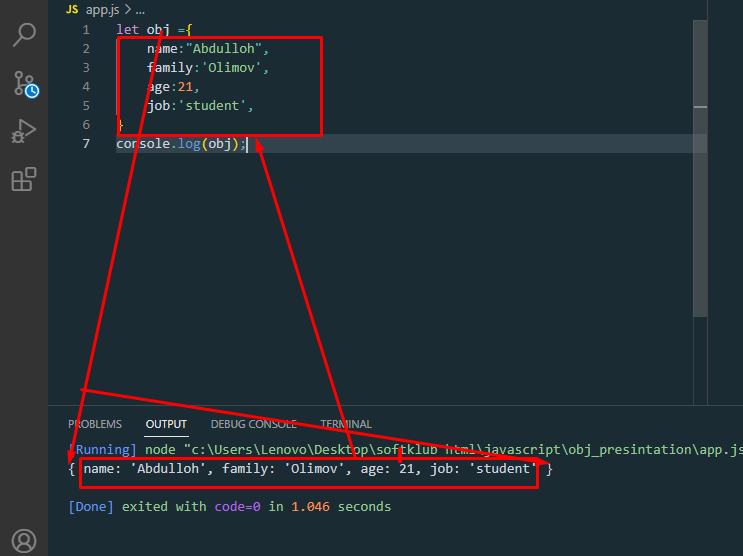
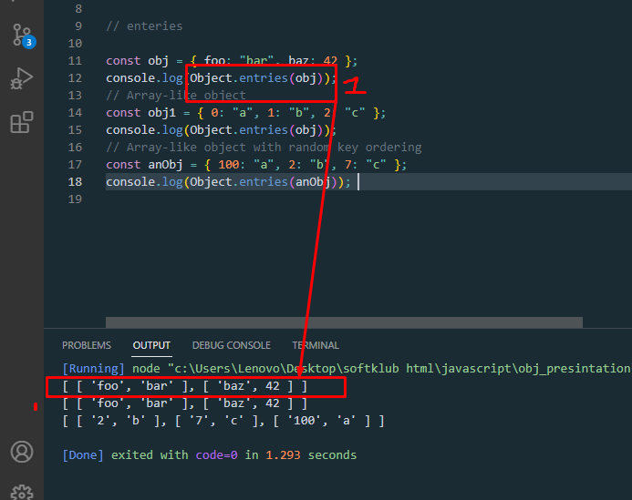
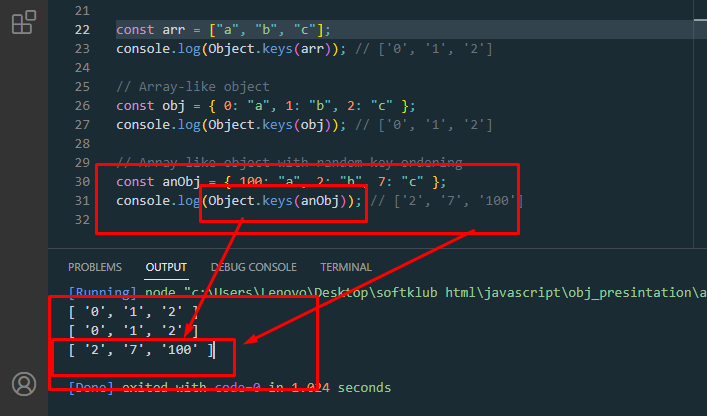
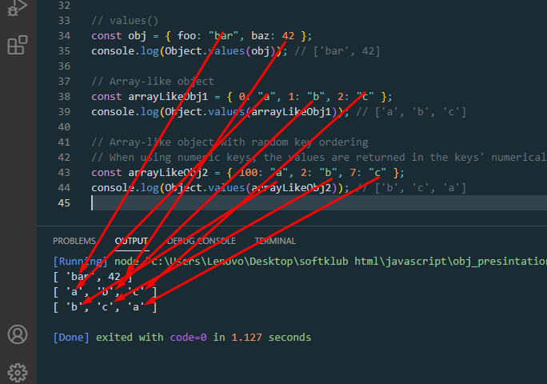
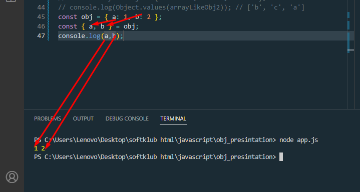
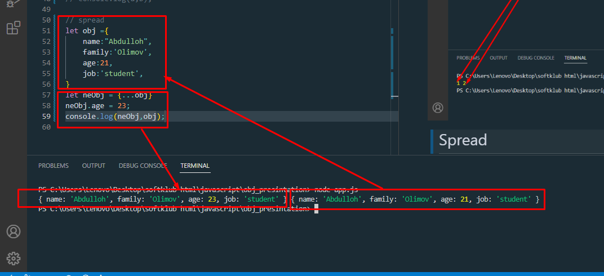
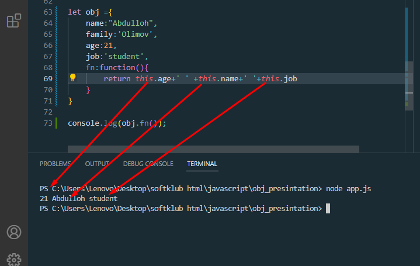
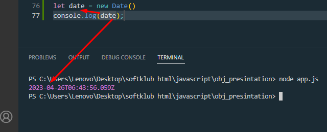
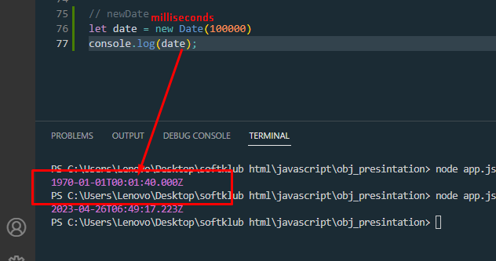
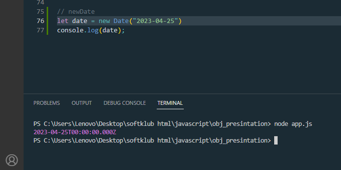

# objekt_presintation
> Дар JavaScript, объект як объекти мустақил буда, дорои хосиятҳо ва навъи . Масалан, онро бо коса муқоиса кунед. Коса ашёест, ки дорои хосиятҳост. Коса дорои ранг, тарҳ, вазн, маводе, ки аз он сохта шудааст ва ғайра. Ҳамин тариқ, объектҳои JavaScript метавонанд хосиятҳое дошта бошанд, ки хусусиятҳои онҳоро муайян мекунанд
 > <h1>Create object</h1>

 

 > <h1>Methods object</h1>
 объект 3 метод дора ки онхо   
1 .Object. keys()  
2.Object.entries()  
3.Object. values() 
> <h1>Objekt enteries()</h1>
Object.entries() массиверо бар мегардонад ма property-ҳо дарун будаашроҳам дар даруни масив гирифта мебарорад
Object.entries()массиверо бар мегардонад, ки унсурҳои он массивҳои мувофиқ ба ҷуфтҳои калиди-арзиши дорои сатри калидӣ буда, мустақиман дар object. Ин ба такрор кардан бо ҳалқа монанд аст for...in, ба истиснои он ки for...in ҳалқа хосиятҳоро дар занҷири прототип низ номбар мекунад. Тартиби массиве, ки аз ҷониби баргардонида мешавад, Object.entries()ҳамон тавре аст, ки for...in давра пешниҳод мекунад.

> objekt.keys()
Object.keys()массиверо бар мегардонад, ки унсурҳои он сатрҳои мувофиқи номҳои моликияти рақамии сатри калидӣ буда, мустақиман дар object.

><h1> OBJEKT VALUES()</h1>  
Object.values() returns an array whose elements are values of enumerable string-keyed properties found directly upon object.

> <h1>Spread</h1>
Деструктуризатсия барои сохтани тағирёбандаҳо аз ҷузъҳои массив ё хосиятҳои объект истифода мешавад. Синтаксиси паҳншуда барои кушодани такроршавандаҳо ба монанди массивҳо, объектҳо ва зангҳои функсия истифода мешавад . Синтаксиси параметри истироҳат массивро аз шумораи номуайяни арзишҳо эҷод мекунад.
> <h1>Destructuring</h1>
The destructuring assignment syntax is a JavaScript expression that makes it possible to unpack values from arrays, or properties from objects, into distinct variables.

> <h1> Spread </h1>
The spread (...) syntax allows an iterable, such as an array or string, to be expanded in places where zero or more arguments (for function calls) or elements (for array literals) are expected. In an object literal, the spread syntax enumerates the properties of an object and adds the key-value pairs to the object being created.

Spread syntax looks exactly like rest syntax. In a way, spread syntax is the opposite of rest syntax. Spread syntax "expands" an array into its elements, while rest syntax collects multiple elements and "condenses" them into a single element. See rest parameters and rest property.

> <h1> How the this keyword works</h1>  
Калимаи калидии "ин" ба объекте дахл дорад, ки порчаи ҷории кодро иҷро мекунад. Он ба объекте ишора мекунад, ки вазифаи ҷориро иҷро мекунад . Агар функсияи истинодшаванда вазифаи муқаррарӣ бошад, "ин" ба объекти глобалӣ ишора мекунад.

> <h1> newDate </h1>
Объектҳои JavaScript Dateяк лаҳзаи ягонаи вақтро дар формати мустақили платформа муаррифӣ мекунанд. DateОбъектҳо адади интегралиро фаро мегиранд, ки миллисонияҳоро аз нисфи шаби аввали 1 январи соли 1970, UTC (давр ) ифода мекунад.

> Creating Date Objekt  
Theare are four ways to create a date objekt  
1) New Date() 
2) New Date(milliseconds) 
3) New Date(Date string) 
4) New Date(year,month,day,hours,hours,minutes,seconds,milliseconds) 

> new Date()  

> milliseconds  

new Date()  
new Date(value) 
new Date(dateString) 
new Date(dateObject) 
new Date(year, monthIndex) 
new Date(year, monthIndex, day) 
new Date(year, monthIndex, day, hours) 
new Date(year, monthIndex, day, hours, minutes) 
new Date(year, monthIndex, day, hours, minutes, seconds) 
new Date(year, monthIndex, day, hours, minutes, seconds, milliseconds) 

